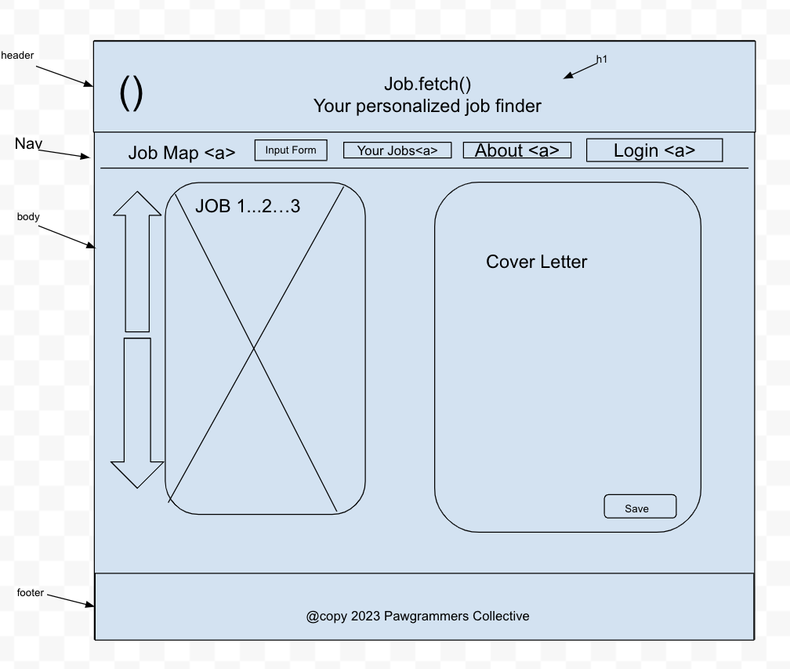

# Job.fetch( )

## Group Members

Kyle Aleman, Johnny Backus, Xin Deng, Brendan Huddleston

### Summary of idea:

The project is a comprehensive tech career preparation and job search engine that integrates job search functionalities, resume building, interview preparation, and career coaching features. Leveraging AI, the platform generates interview questions and cover letters based on job descriptions and uploaded resumes. This all-in-one solution aims to streamline the tech job search process, enhance candidate preparation, and provide personalized career coaching.

### What problem or pain point does it solve?

The platform addresses the challenges faced by tech job seekers, offering a centralized hub for job search, resume building, and interview preparation. It solves the pain points of scattered resources, lack of personalized guidance, and the time-consuming nature of tailoring application materials for specific job opportunities.

### Minimum Viable Product (MVP) definition.

The platform should demonstrate the key features of job search, filtering, and saving, as well as the AI-driven interview question and cover letter generation.


### Wireframes 

1. Homepage Wireframe


2. About Us Wireframe


### User Stories

1. Ingredients Dropdown(s)

    - User Story sentence
      - As a user, I want to be able to choose ingredients for a cocktail so that I have some control over how my cocktail will taste
    - Feature Tasks
      - Create an instructions panel above the drop down menus 
      - Create Dropdown of base: four options (Rum, Vodka, Whisky, Gin)
      - Create Dropdown of citrous: three options (lemon, lime, orange, grapefruit)
      - Create Dropdown of bitter: four options (bitters, campari, cynar, aperol)
      - Create Dropdown of sweet: four options (simple syrup, sweet vermouth, dry vermouth, honey syrup)

    - Acceptance Tests
      - dropdown menus will display appropriate ingredients
      - section with instructions is rendered on page
      - ingredients selected stays on page 

    - Estimate your User Stories: 1-2 days 

1. Recipe

    - User Story sentence
      - As a user, I want the website to provide me with a finished cocktail recipe so that I do not have to calculate volumes. 
    - Feature Tasks
      - Recipe should show all ingredients I chose
      - Recipe should show all volumes of each ingredient
      - Recipe will display when I click the submit button for the form
    - Acceptance Tests
      - All ingredients should be listed by name and be the ones the user chose. 
      - Volumes should be rounded to nearest 0.25 oz or one “dash”
      - Each ingredient should have a specific volume attributed to them - set static values
      - Display random name of cocktail
    - Estimate your User Stories: 2.5 days

1. About Us

    - User Story sentence
      - As a user, I want a link from the main page to an about us page that introduces each member and a summary of the organization so that I know who/what the roles were 
    - Feature Tasks
      - anchor tags from home page to ‘about us’ and vice versa
      - Section for each member of the team that gives a brief intro, picture, favorite cocktail
      - Paragraph of the mission/values of the team
      - Statically coded into html
    - Acceptance Tests
      - HTML/CSS loads correctly
      - Adjusts to users Viewport
      - Layout is correct
    - Estimate your User Stories: 3 hours

1. Cocktail Image

    - User Story sentence
      - As a user, I want and image of the cocktail displayed next to the recipe so that I can see what the cocktail should look like. 
    - Feature Tasks
      - Image Size
      - Select cocktail images, one per base alcohol (4)
    - Acceptance Tests
      - Image replaces placeholder image without distorting the rest of the layout.
      - cocktail image should be appropriately sized and aligned next to the recipe.
      - the displayed image should correspond to that particular cocktail.
    - Estimate your User Stories: 4-8 hours for frontend and backend pieces of work

1. Dropdown Hover state

    - User Story sentence
      - As someone who is not familiar with cocktails, I want a feature that will allow me to hover over an item in the dropdown so that it clarifies the ingredient  
    - Feature Tasks
      - Description disappears once user moves cursor
      - Input descriptors for each ingredients 
    - Acceptance Tests
      - Info. pops up and goes away depending on cursor
    - MVP - Hover for each category
    - Estimate your User Stories - 4 hours

### Domain Modeling 

```
Draw out the entities for your project and how they are related to each other. Determine the relationships between the functions/methods and entities of your app.

Include in your domain model the names and data types of your entities and their properties.
```


1. Domain Model


<!-- ### Using a Database? Make an Database Schema Diagram ?

If you are using a database of any kind in your project, draft out what your schema will look like by creating a diagram of all your application data models, each in it’s own collection (or table).

Be sure to identify the relationships (if any) between each of your data models:

1. Does a single item in your database “belong to” just one other item in your database? For example, a person has one passport, and a passport belongs to a single person.
1. Does a item in your database “belong to” multiple other items in your database? For example, a house has many residents, and each resident has one primary house.
1. Do many items in your database relate to many other items in your database? For example, a band has many musicians, and a musician can be in many bands.

Also, include for each separate collection:

1. The name of each property stored in the collection.
1. The required data type.
1. An indication if this collection is associated with another collection.

Include this diagram in your readme, accompanied by an explanation of each data model and it’s responsibility in the application. -->
